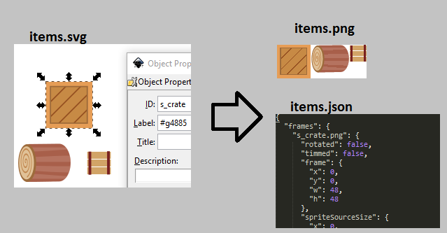

# SVGAtlasGenerator
Tool to automatically generate texture atlases from svg files. 

###How it works:

1. Observe given directory for changes to svg files.
2. On change, enumerate svg to find all objects with names matching the pattern.
3. Render these objects into atlas .png and create .json.
4. Created .json is at least partially compatible with TexturePacker.

###More ideas:
1. Perhaps it would be simpler to just scan the directory when the game starts.

